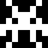
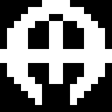
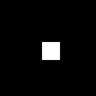

<div align="center">
  


</div>

# Space Shooter Game on AK Embedded Base Kit

<hr>

## System Documentation

| Document | Purpose |
|---|---|
| [README.md](README.md) | High-level system overview, target hardware, and game mechanics. |
| [docs/01-guide-getting-started.md](docs/01-guide-getting-started.md) | Step-by-step instructions for environment setup and project initialization. |
| [docs/02-guide-coding-rules.md](docs/02-guide-coding-rules.md) | Standardized coding conventions and commit message formats. |
| [docs/03-design-sequence-object.md](docs/03-design-sequence-object.md) | Detailed sequence diagrams defining the lifecycle of in-game entities. |
| [docs/04-design-sequence-runtime.md](docs/04-design-sequence-runtime.md) | System architecture detailing signal processing and task scheduling. |

## 1. Overview

Space Shooter is an embedded software project developed for the AK Embedded Base Kit. It demonstrates the implementation of a classic arcade game using a cooperative event-driven OS.

This repository provides practical examples of:

- **System design:** Modelling complex logic flows with UML.
- **Process management:** Coordinating cooperative Tasks and scheduling them efficiently.
- **Communication:** Using Signals, Timers, and Messages to react in real time.
- **Control logic:** Building robust state machines for the player, the enemies, and the overall match progression.

## 2. Hardware Platform

<table align="center">
  <tr>
    <td align="center"></td>
  </tr>
</table>
<p align="center"><strong><em>Figure 1:</em></strong> AK Embedded Base Kit - STM32L151</p>

The game is designed to run on the [AK Embedded Base Kit](https://epcb.vn/products/ak-embedded-base-kit-lap-trinh-nhung-vi-dieu-khien-mcu). It utilizes a **1.54" OLED display** for graphics rendering, **three push buttons** for user input, and a **buzzer** for audio feedback.

**Microcontroller Specifications:**

```text
SoC Name : STM32L151CBT6
RAM      : 16 KB

Flash Partitions Layout
----------------------
[ 0x08000000 - 0x08001FFF ] : Bootloader Partition (8 KB)
=> AK Bootloader

[ 0x08002000 - 0x08002FFF ] : BSF Shared Partition (4 KB)
=> Used for data sharing between Bootloader and Application

[ 0x08003000 - 0x0801FFFF ] : Application Partition (116 KB)
=> Space Shooter Firmware
```

**MCU Naming Convention:**

| Part | Meaning |
|---|---|
| `STM32` | STMicroelectronics 32-bit MCU family. |
| `L` | Low-power series. |
| `151` | STM32L151 product line. |
| `C` | 48-pin package. |
| `B` | 128 KB Flash memory. |
| `T` | LQFP package. |
| `6` | Industrial temperature grade. |

<table align="center">
  <tr>
    <td align="center"></td>
  </tr>
</table>
<p align="center"><strong><em>Figure 2:</em></strong> Board view Top + Bottom </p>

## 3. Game Mechanics and Objects

The application boots into a **Title Screen**, progressing to a **Main Menu** containing the following options:

- **Play:** Initialize a new game session.
- **Setting:** Adjust system parameters (Sound, Difficulty).
- **High score:** Display the highest recorded scores.

### Defined Entities:

| Bitmap | Entity | Functional Description |
| :---: | :--- |:--- |
| <br> | **Player** | The user-controlled unit and its animated engine exhaust. Supports horizontal translation (Left/Right) and weapon discharge. |
|  | **Bullet** | Projectiles instantiated by either the Player or the Boss. Features simple vertical translation and AABB collision detection. |
| <br><br><br><br> | **Enemy** | Computer-controlled units spawned in a grid format. They traverse horizontally and drop downward upon hitting the screen edges (Space Invaders style). Includes specialized types like Carriers and Spread Shooters. |
|  | **Boss** | A high-HP entity that spawns every 3 stages. Features horizontal movement, high health, and multi-projectile burst attacks. |
| <br><br> | **Powerup** | Dropped conditionally upon Enemy destruction. Applies temporary state modifiers to the Player (Super bullet, Shield, Nuke). |
|  | **Explosion** | A transient visual effect rendered at the coordinates of a destroyed entity using particle animation (drawing API). |
| <br><br><br><br> | **UI Elements** | Assorted UI icons (Play, Settings, High Score, Menu, Hearts) used in menus and the HUD. |

### How to Play & Game Mechanics:

- **Controls:** Navigate the Player unit horizontally (Left/Right) using the **[Up]** and **[Down]** hardware buttons. Trigger the primary weapon using the **[Mode]** button.
- **Scoring:** Each enemy destroyed is worth points based on its type. The running score and current lives are shown at the top of the screen.
- **Waves & Difficulty:** As stages progress, the game dynamically spawns more enemies and increases their movement speed. The starting difficulty (EASY, MED, HARD) can be customized in the **Setting** menu.
- **Powerups:** Destroying enemies has a chance to drop powerups that provide temporary invincibility shields, weapon upgrades (super bullet), or a screen-clearing nuke.
- **Boss Fights:** Every 3 stages, a powerful Boss ship appears, requiring the player to dodge multi-projectile burst attacks and chip away at its high health pool.
- **Game Over:** When the Player's life counter reaches zero, the match ends and the score is saved. The player can then view the top 3 highest scores in the **High score** menu.

## 4. Technical Architecture

> **Reference:** For comprehensive documentation on system execution flows and object interaction, refer to [Runtime Signal Processing](docs/04-design-sequence-runtime.md) and [Game Object Sequences](docs/03-design-sequence-object.md).

## 5. Contact & Support
``` Note
Thank you for visiting this repository.
If you have any questions, suggestions, or feedback about this project or firmware development, feel free to contact me directly.
```

<a href="https://github.com/Khang123699">
  
</a>
<a href="https://www.linkedin.com/in/khang-nguyen-nhat/">
  
</a>
