<div align="center">
  


</div>

# Space Shooter Game on AK Embedded Base Kit

<table align="center">
  <tr>
    <td align="center">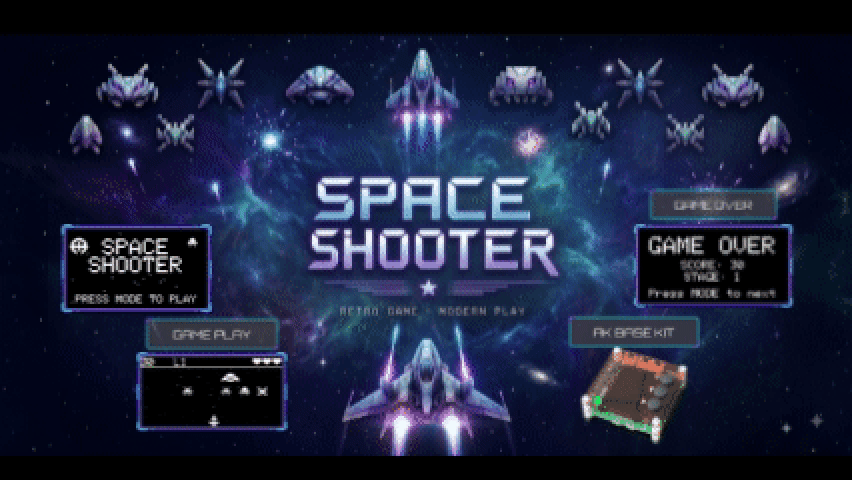</td>
  </tr>
</table>

## GamePlay Demo
<div align="center">
  <video src="https://github.com/user-attachments/assets/b6ae2fad-1937-49b5-8bcb-346576daeeec" controls width="480"></video>
</div>

<hr>

## System Documentation

| Document | Purpose |
|---|---|
| [README.md](README.md) | Project overview, target hardware, and game mechanics. |
| [resources/docs/01-guide-getting-started.md](resources/docs/01-guide-getting-started.md) | Step-by-step instructions for environment setup and project initialization. |
| [resources/docs/02-guide-coding-rules.md](resources/docs/02-guide-coding-rules.md) | Standardized coding conventions and commit message formats. |
| [resources/docs/03-design-sequence-object.md](resources/docs/03-design-sequence-object.md) | Detailed sequence diagrams defining the lifecycle of in-game entities. |
| [resources/docs/04-design-sequence-runtime.md](resources/docs/04-design-sequence-runtime.md) | System architecture detailing signal processing and task scheduling. |
| [resources/docs/05-design-data-storage.md](resources/docs/05-design-data-storage.md) | Persistent storage mechanism for settings and high scores in internal EEPROM. |

## Introduction
Space Shooter is a classic shooting game inspired by the famous "Chicken Invaders" genre. The game was developed using the AK Embedded Kit, a hands-on platform designed to help embedded programming learners explore event-driven programming on the AKOS real-time operating system. Through this project, learners can apply concepts such as event handling, state management, and task scheduling within a practical, interactive embedded application.

### I. Hardware

<table align="center">
  <tr>
    <td align="center"></td>
  </tr>
</table>
<p align="center"><strong><em>Figure 1:</em></strong> AK Embedded Base Kit - STM32L151</p>

The game is designed to run on the [AK Embedded Base Kit](https://epcb.vn/products/ak-embedded-base-kit-lap-trinh-nhung-vi-dieu-khien-mcu). It utilizes a **1.54" OLED display** for graphics rendering, **three push buttons** for user input, and a **buzzer** for audio feedback.

**Microcontroller Specifications:**

```text
SoC Name : STM32L151CBT6
RAM      : 16 KB

Flash Partitions Layout
----------------------
[ 0x08000000 - 0x08001FFF ] : Bootloader Partition (8 KB)
=> AK Bootloader

[ 0x08002000 - 0x08002FFF ] : BSF Shared Partition (4 KB)
=> Used for data sharing between Bootloader and Application

[ 0x08003000 - 0x0801FFFF ] : Application Partition (116 KB)
=> Space Shooter Firmware
```

**MCU Naming Convention:**

| Part | Meaning |
|---|---|
| `STM32` | STMicroelectronics 32-bit MCU family. |
| `L` | Low-power series. |
| `151` | STM32L151 product line. |
| `C` | 48-pin package. |
| `B` | 128 KB Flash memory. |
| `T` | LQFP package. |
| `6` | Industrial temperature grade. |

<table align="center">
  <tr>
    <td align="center"></td>
  </tr>
</table>
<p align="center"><strong><em>Figure 2:</em></strong> Board view Top + Bottom </p>

### II. Game Description and Objects

The application boots into a **Title Screen**, progressing to a **Main Menu** containing the following options:

- **Play:** Initialize a new game session.
- **Setting:** Adjust system parameters (Sound, Difficulty).
- **High score:** Display the highest recorded scores.
- **Exit:** Return to the Title Screen.

### User Interface & Game Screens:

<table align="center">
  <tr>
    <td align="center">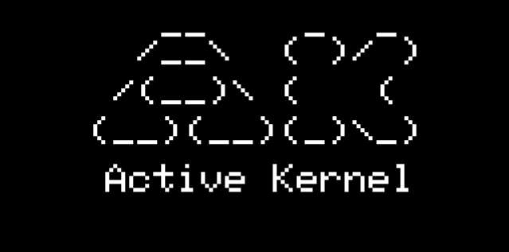</td>
  </tr>
</table>
<p align="center"><strong><em>Figure 3:</em></strong> Active Kernel Boot Logo</p>

<table align="center">
  <tr>
    <td align="center">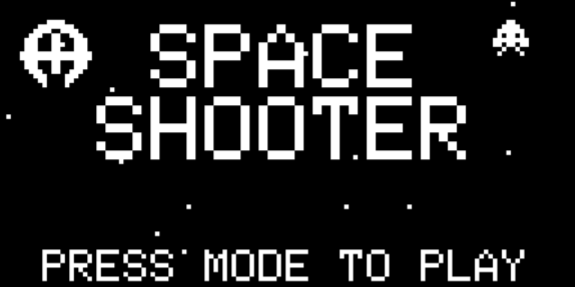</td>
  </tr>
</table>
<p align="center"><strong><em>Figure 4:</em></strong> Title Screen</p>

<table align="center">
  <tr>
    <td align="center">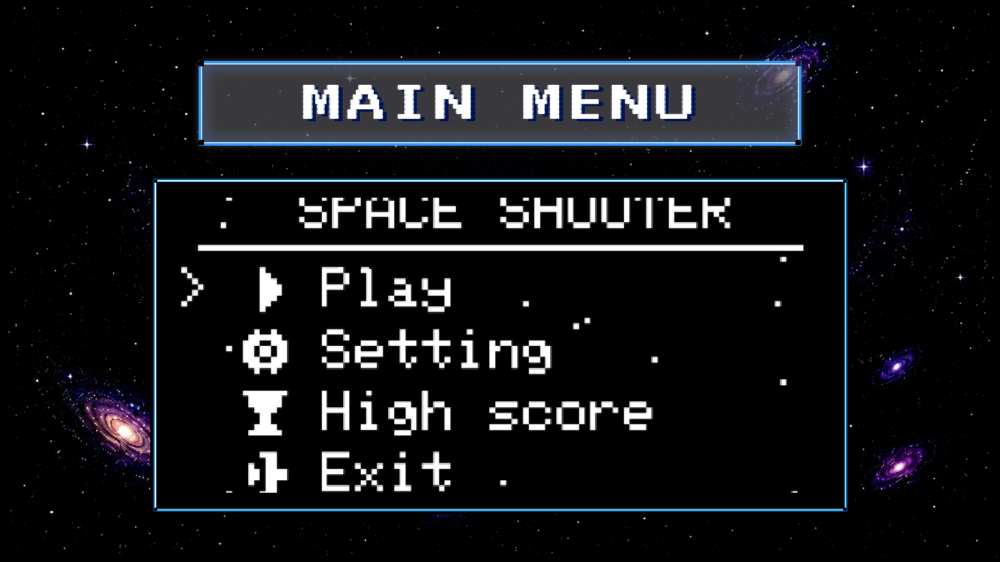</td>
  </tr>
</table>
<p align="center"><strong><em>Figure 5:</em></strong> Main Menu</p>

<table align="center">
  <tr>
    <td align="center">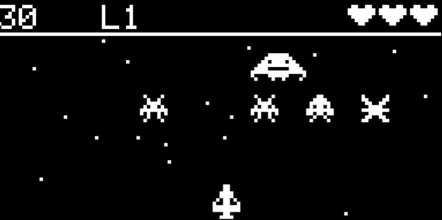</td>
  </tr>
</table>
<p align="center"><strong><em>Figure 6:</em></strong> Standard Gameplay</p>

<table align="center">
  <tr>
    <td align="center">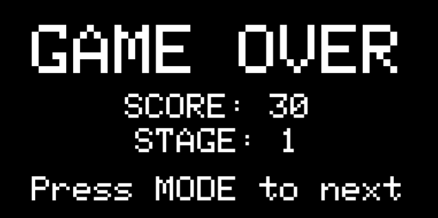</td>
  </tr>
</table>
<p align="center"><strong><em>Figure 7:</em></strong> Game Over Screen</p>

<table align="center">
  <tr>
    <td align="center">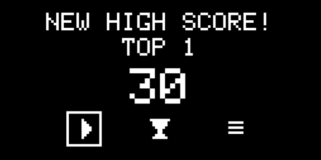</td>
  </tr>
</table>
<p align="center"><strong><em>Figure 8:</em></strong> Summary Screen</p>

### Defined Entities:

| Bitmap | Entity | Functional Description |
| :---: | :--- |:--- |
| <br> | **Player** | The user-controlled unit and its animated engine exhaust. Supports horizontal translation (Left/Right) and weapon discharge. |
|  | **Bullet** | Projectiles instantiated by either the Player or the Boss. Features simple vertical translation and AABB collision detection. |
| <br><br><br><br> | **Enemy** | Computer-controlled units spawned in a grid format. They traverse horizontally and drop downward upon hitting the screen edges (Space Invaders style). Includes specialized types like Carriers and Spread Shooters. |
|  | **Boss** | A high-HP entity that spawns every 3 stages. Features horizontal movement, high health, and advanced mechanics: Enrage (5-way spread attack when <50% HP), Dash Attack (rapidly dives toward the player), and Summoning (spawns 2 minions). |
| <br><br> | **Powerup** | Dropped conditionally upon Enemy destruction. Applies temporary state modifiers to the Player (Super bullet, Shield, Nuke). |
| 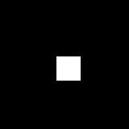 | **Explosion** | A transient visual effect rendered at the coordinates of a destroyed entity using particle animation (drawing API). |
| <br><br><br><br> | **UI Elements** | Assorted UI icons (Play, Settings, High Score, Exit, Menu, Hearts) used in menus and the HUD. |

### III. How to Play:

You control the Player ship. Use the **[Up]** and **[Down]** buttons to navigate horizontally (Left/Right) across the screen. Holding either button moves the ship faster.

Press the **[Mode]** button to fire a Bullet at the incoming Enemies.

Enemies appear from the top of the screen in a grid formation and slowly drop downward towards you (Space Invaders style).

The goal is to score as many points as possible. Points are awarded based on the enemy's base score scaled by the difficulty level. The match ends when the Player's life counter reaches zero.

#### Game Mechanics:

- **Waves & Difficulty:** As stages progress, the game dynamically spawns more enemies and increases their movement speed. The starting difficulty (EASY, MED, HARD) can be customized in the **Setting** menu.
- **Powerups:** Destroying enemies has a chance to drop powerups that provide temporary invincibility shields, weapon upgrades (super bullet), or a screen-clearing nuke.
- **Boss Fights:** Every 3 stages, a powerful Boss ship appears. The Boss features dynamic phases: it can perform rapid **Dash Attacks** toward the player, **Summon** minions for backup, and enter an **Enraged** state (firing a 5-way spread of projectiles) when its health drops below 50%.
- **Game Over:** When the Player's life counter reaches zero, the match ends and the score is saved. The player can then view the top 3 highest scores in the **High score** menu.

### IV. Basic Game Sequence Logic

The diagram below illustrates the basic program execution flow, as well as the sequence of messages and actions over time within a 50 ms cycle of the game loop.

#### 1. Screen Entry
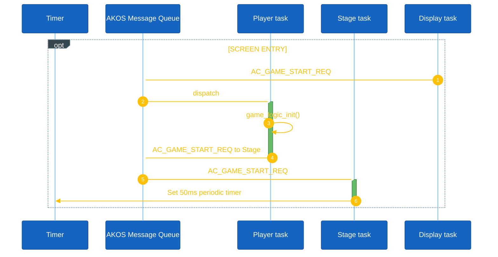
```mermaid
%%{init: {'theme':'base','themeVariables':{'fontSize':'18px','primaryColor':'#1565c0','primaryTextColor':'#ffffff','primaryBorderColor':'#0d47a1','lineColor':'#90a4ae','signalColor':'#ffc107','signalTextColor':'#ffc107','actorBkg':'#1565c0','actorBorder':'#0d47a1','actorTextColor':'#ffffff','actorLineColor':'#90caf9','noteBkgColor':'#fff59d','noteTextColor':'#000000','noteBorderColor':'#f57f17','activationBkgColor':'#66bb6a','activationBorderColor':'#2e7d32','sequenceNumberColor':'#ffffff','loopTextColor':'#ffc107','labelBoxBkgColor':'#37474f','labelBoxBorderColor':'#90a4ae','labelTextColor':'#ffffff'},'sequence':{'actorMargin':40,'messageFontSize':17,'noteFontSize':15,'actorFontSize':17,'boxMargin':15,'boxTextMargin':8,'noteMargin':12,'useMaxWidth':true}}}%%
sequenceDiagram
    autonumber
    participant Tmr as Timer
    participant Q as AKOS Message Queue
    participant Plr as Player task
    participant Stg as Stage task
    participant UI as Display task

    opt SCREEN ENTRY
        UI-)Q: AC_GAME_START_REQ
        Q-)Plr: dispatch
        activate Plr
        Plr->>Plr: game_logic_init()
        Plr-)Q: AC_GAME_START_REQ to Stage
        deactivate Plr
        
        Q-)Stg: AC_GAME_START_REQ
        activate Stg
        Stg->>Tmr: Set 50ms periodic timer
        deactivate Stg
    end
```

#### 2. Game Play
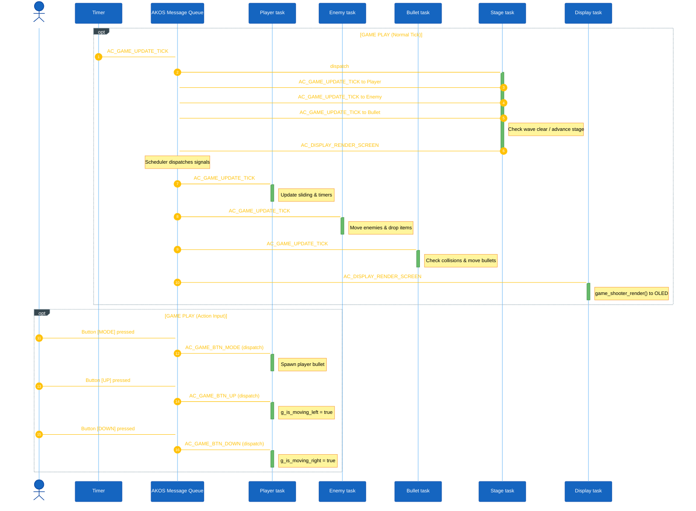
```mermaid
%%{init: {'theme':'base','themeVariables':{'fontSize':'18px','primaryColor':'#1565c0','primaryTextColor':'#ffffff','primaryBorderColor':'#0d47a1','lineColor':'#90a4ae','signalColor':'#ffc107','signalTextColor':'#ffc107','actorBkg':'#1565c0','actorBorder':'#0d47a1','actorTextColor':'#ffffff','actorLineColor':'#90caf9','noteBkgColor':'#fff59d','noteTextColor':'#000000','noteBorderColor':'#f57f17','activationBkgColor':'#66bb6a','activationBorderColor':'#2e7d32','sequenceNumberColor':'#ffffff','loopTextColor':'#ffc107','labelBoxBkgColor':'#37474f','labelBoxBorderColor':'#90a4ae','labelTextColor':'#ffffff'},'sequence':{'actorMargin':40,'messageFontSize':17,'noteFontSize':15,'actorFontSize':17,'boxMargin':15,'boxTextMargin':8,'noteMargin':12,'useMaxWidth':true}}}%%
sequenceDiagram
    autonumber
    actor Btn as Button
    participant Tmr as Timer
    participant Q as AKOS Message Queue
    participant Plr as Player task
    participant Enm as Enemy task
    participant Bul as Bullet task
    participant Stg as Stage task
    participant UI as Display task

    opt GAME PLAY (Normal Tick)
        Tmr-)Q: AC_GAME_UPDATE_TICK
        Q-)Stg: dispatch
        activate Stg
        Stg-)Q: AC_GAME_UPDATE_TICK to Player
        Stg-)Q: AC_GAME_UPDATE_TICK to Enemy
        Stg-)Q: AC_GAME_UPDATE_TICK to Bullet
        Note right of Stg: Check wave clear / advance stage
        Stg-)Q: AC_DISPLAY_RENDER_SCREEN
        deactivate Stg

        Note over Q: Scheduler dispatches signals

        Q-)Plr: AC_GAME_UPDATE_TICK
        activate Plr
        Note right of Plr: Update sliding & timers
        deactivate Plr

        Q-)Enm: AC_GAME_UPDATE_TICK
        activate Enm
        Note right of Enm: Move enemies & drop items
        deactivate Enm

        Q-)Bul: AC_GAME_UPDATE_TICK
        activate Bul
        Note right of Bul: Check collisions & move bullets
        deactivate Bul

        Q-)UI: AC_DISPLAY_RENDER_SCREEN
        activate UI
        Note right of UI: game_shooter_render() to OLED
        deactivate UI
    end

    opt GAME PLAY (Action Input)
        Btn-)Q: Button [MODE] pressed
        Q-)Plr: AC_GAME_BTN_MODE (dispatch)
        activate Plr
        Note right of Plr: Spawn player bullet
        deactivate Plr
        
        Btn-)Q: Button [UP] pressed
        Q-)Plr: AC_GAME_BTN_UP (dispatch)
        activate Plr
        Note right of Plr: g_is_moving_left = true
        deactivate Plr

        Btn-)Q: Button [DOWN] pressed
        Q-)Plr: AC_GAME_BTN_DOWN (dispatch)
        activate Plr
        Note right of Plr: g_is_moving_right = true
        deactivate Plr
    end
```

#### 3. Game Over
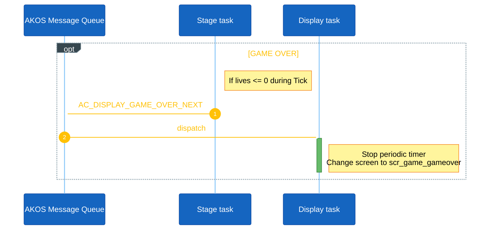
```mermaid
%%{init: {'theme':'base','themeVariables':{'fontSize':'18px','primaryColor':'#1565c0','primaryTextColor':'#ffffff','primaryBorderColor':'#0d47a1','lineColor':'#90a4ae','signalColor':'#ffc107','signalTextColor':'#ffc107','actorBkg':'#1565c0','actorBorder':'#0d47a1','actorTextColor':'#ffffff','actorLineColor':'#90caf9','noteBkgColor':'#fff59d','noteTextColor':'#000000','noteBorderColor':'#f57f17','activationBkgColor':'#66bb6a','activationBorderColor':'#2e7d32','sequenceNumberColor':'#ffffff','loopTextColor':'#ffc107','labelBoxBkgColor':'#37474f','labelBoxBorderColor':'#90a4ae','labelTextColor':'#ffffff'},'sequence':{'actorMargin':40,'messageFontSize':17,'noteFontSize':15,'actorFontSize':17,'boxMargin':15,'boxTextMargin':8,'noteMargin':12,'useMaxWidth':true}}}%%
sequenceDiagram
    autonumber
    participant Q as AKOS Message Queue
    participant Stg as Stage task
    participant UI as Display task

    opt GAME OVER
        Note right of Stg: If lives <= 0 during Tick
        Stg-)Q: AC_DISPLAY_GAME_OVER_NEXT
        Q-)UI: dispatch
        activate UI
        Note right of UI: Stop periodic timer<br/>Change screen to scr_game_gameover
        deactivate UI
    end
```

### V. Technical Architecture

> **Reference:** For comprehensive documentation on system execution flows and object interaction, refer to [Runtime Signal Processing](resources/docs/04-design-sequence-runtime.md) and [Game Object Sequences](resources/docs/03-design-sequence-object.md).

## Contact & Support
``` Note
Thank you for visiting this repository.
If you have any questions, suggestions, or feedback about this project, feel free to contact me directly.
```

<a href="https://github.com/Khang123699">
  
</a>
<a href="https://www.linkedin.com/in/khang-nguyen-nhat/">
  
</a>
