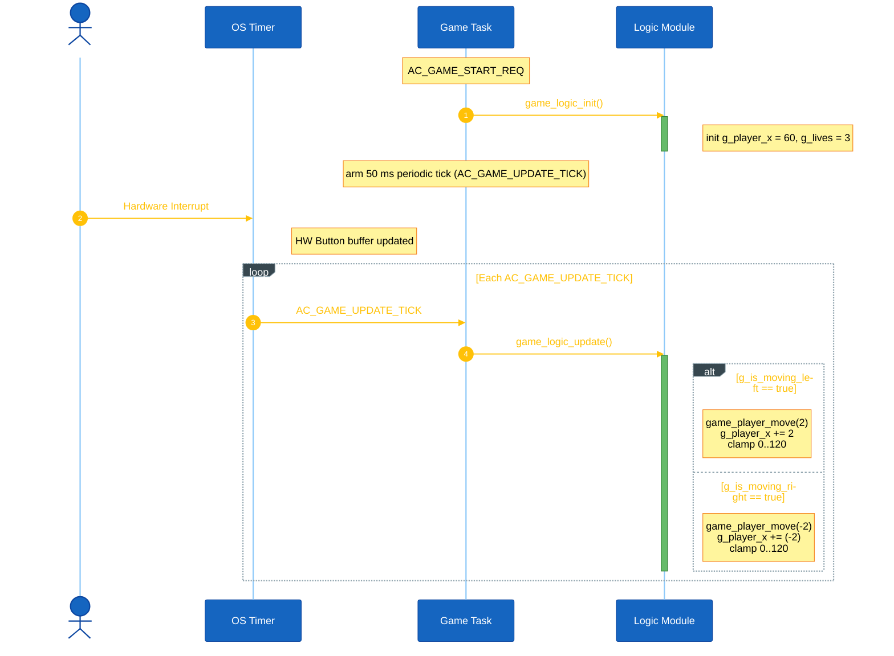
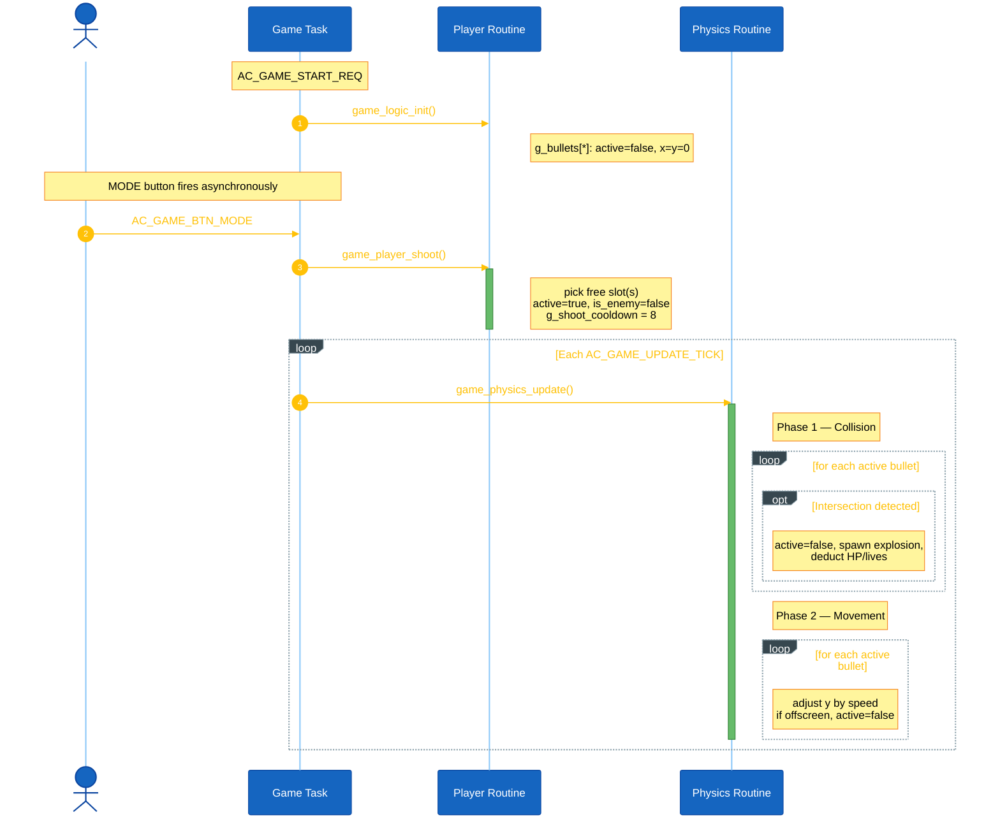
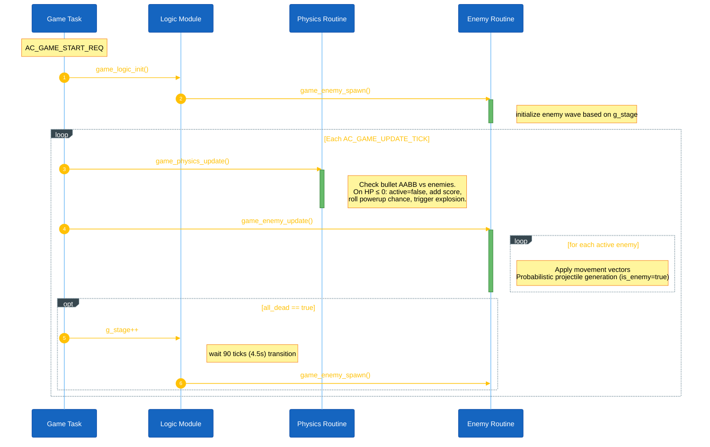

<h1 align="center">Game Object Sequences</h1>

This document describes the runtime sequence of each main object in Space Shooter. Space Shooter centralizes object synchronization inside `game_shooter_logic.cpp`. All objects are evaluated periodically via the `AC_GAME_UPDATE_TICK` signal.

## I. Object Summary

| Object | Data | Routine | Main responsibility |
|---|---|---|---|
| Player | `g_player_x`, `g_lives` | `game_player_move()` | Controls the user-controlled unit and tracks volatile health parameters. |
| Bullet | `g_bullets[]` | `game_bullets_update()` | Handles translation of projectiles and collision validation. |
| Enemy | `g_enemies[]` | `game_enemy_update()` | Handles movement logic, pseudo-random generation, and boss spawning. |
| Powerup | `g_powerups[]` | `game_powerups_update()` | Translates active modifiers (shield, super bullet, nuke) and handles expiration. |
| Explosion | `g_explosions[]` | `update_explosions()` | Renders transient visual particle effects at entity destruction coordinates. |
| Star | `g_stars[]` | `game_background_update()` | Background parallax rendering. |

The main Game task (`game_shooter_task.cpp`) sets up a 50ms periodic timer generating `AC_GAME_UPDATE_TICK`. On each tick, `game_logic_update()` is invoked to synchronously fan out processing to each object routine.

## II. Player Object Sequence

Player owns the coordinate `g_player_x` and state trackers (`g_lives`, `g_score`).

**Setup.** `game_logic_init()` parks the player at `x = 60` and sets `g_lives = 3`.

**Input.** The hardware button driver translates physical presses into `AC_GAME_BTN_*_PRESSED` and `AC_GAME_BTN_*_RELEASED` messages. `game_shooter_task` catches these to toggle boolean flags (`g_is_moving_left`, `g_is_moving_right`).

**Per-tick.** Smooth sliding state is handled via `g_is_moving_left` and `g_is_moving_right` flags:
- If a flag is active (button held) — calls `game_player_move()` to continuously adjust `g_player_x` and clamps to screen bounds.
- Blinking logic: `g_player_blink` is decremented each tick if `> 0`.

**Reset.** Handled inside `game_logic_init()`.

<strong><em>Figure 1:</em></strong> Player sequence logic

## III. Bullet Object Sequence

Bullet owns the `g_bullets[MAX_BULLETS]` array. It handles shooting from the MODE button.

**Setup.** `game_logic_init()` clears every slot to `0`.

**Input.** On `AC_GAME_BTN_MODE` the Game task calls `game_player_shoot()`. It picks the first free slot in `g_bullets[]`, spawns it at `(g_player_x + 4, 52)`, and sets `is_enemy = false`.

**Per-tick.** Each `AC_GAME_UPDATE_TICK` calls `game_physics_update()`:
- **Collision Check:** Player bullets are checked against active enemies. If `g_player_super_bullet_timer > 0` (Super Bullet active), each hit deals 3 damage instead of 1. Enemy bullets are checked against the player via pixel-perfect collision.
- **Movement:** Visible bullets shift (`y -= speed` for player, `y += speed` for enemies). Bullets leaving the screen (`y < 0` or `y > 64`) are marked `active = false`.

**Cross-task (Enemy).** `game_enemy_update()` may randomly spawn bullets targeting the player with `is_enemy = true`.

<strong><em>Figure 2:</em></strong> Bullet sequence logic

## IV. Enemy Object Sequence

Enemy owns the `g_enemies[MAX_ENEMIES]` array.

**Setup.** `game_logic_init()` clears every slot, then invokes `game_enemy_spawn()` to populate the initial wave.

**Per-tick.** Each `AC_GAME_UPDATE_TICK` calls `game_enemy_update()`:
- **Movement & Abilities:** Normal enemies (Type 1–3) move horizontally in sync with `enemy_dir` at a speed that scales with `g_stage`. The Boss (Type 4) utilizes an internal state machine to execute dynamic phases (Dash Charge, Dash Down, Dash Up, Summon) and an Enrage mode when HP < 50%. The Spread Shooter (Type 5) fires 3-way bursts. The Carrier (Type 6) periodically spawns new enemies.
- **Spawn Check:** Handled by `game_stage_update()` — if all enemies are `active = false`, `g_stage` increments and starts a 90-tick (4.5s) transition timer before calling `game_enemy_spawn()`.

**Collision.** `game_physics_update()` handles AABB intersections. For enemy-player collisions, normal enemies are destroyed upon impact, while the Boss survives to prevent instant mechanical bypass. When an enemy's HP drops to 0, the system adds to `g_score`, potentially spawns a Powerup, triggers an Explosion, and marks the slot `active = false`.

<strong><em>Figure 3:</em></strong> Enemy sequence logic

## V. Per-Tick Execution Order

On every `AC_GAME_UPDATE_TICK` (50ms interval), `game_shooter_task` invokes `game_logic_update()` which processes logic in the following sequence:

1. `update_player_sliding_and_timers()`: Updates smooth movement flags and countdown active timers (blink, shield, cooldown).
2. `game_physics_update()`: Checks AABB collisions, handles bullet movement and damage.
3. `game_enemy_update()`: Handles enemy translation and hostile bullet generation.
4. `game_powerups_update()`: Translates active powerups.
5. `game_stage_update()`: Wave validation, advances stage if all enemies are dead.
6. `game_check_game_over()`: Transitions state if the player runs out of lives.
7. Post `AC_DISPLAY_RENDER_SCREEN` to the UI task to update the interface.

## VI. Code References

| Object | Source file | Header file |
|---|---|---|
| Main Task | `game_shooter_task.cpp` | `game_shooter.h` |
| Logic & Core Loop | `game_shooter_logic.cpp` | `game_shooter.h` |
| Player (Move/Shoot) | `game_shooter_player.cpp` | `game_shooter.h` |
| Bullet & Collision | `game_shooter_bullets.cpp` | `game_shooter.h` |
| Physics Orchestrator | `game_shooter_physics.cpp` | `game_shooter.h` |
| Background (Parallax) | `game_shooter_background.cpp` | `game_shooter.h` |
| Enemy (Movement/AI) | `game_shooter_enemy.cpp` | `game_shooter.h` |
| Enemy Spawn | `game_shooter_enemy_spawn.cpp` | `game_shooter.h` |
| Boss | `game_shooter_boss.cpp` | `game_shooter.h` |
| Carrier | `game_shooter_carrier.cpp` | `game_shooter.h` |
| Stage & Powerup | `game_shooter_stage.cpp` | `game_shooter.h` |
| Save Game | `game_save.cpp` | `game_save.h` |
| UI & Screens | `screens/scr_game_*.cpp` | `screens/screens.h` |

> **Note:** All files above are located in `application/sources/app/space_shooter/`, except UI & Screens which are in `application/sources/app/screens/`.
