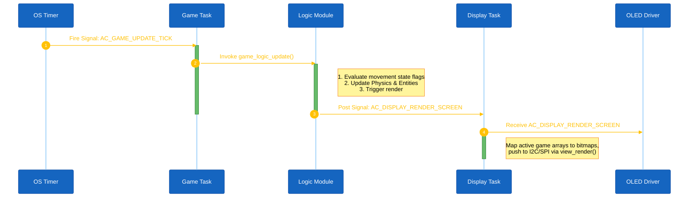

<h1 align="center">Runtime Signal Processing</h1>

This document details the signal routing, inter-task communication, timing execution, and rendering loops within the Space Shooter architecture. The application is built upon the AKOS event-driven operating system framework.

## 1. System Architecture Overview

In Space Shooter, the application logic is completely decoupled from the rendering logic.
- **`AC_TASK_GAME_SHOOTER_ID`**: Manages all game state, physics calculations, entity updates, and synchronous input polling.
- **`AC_TASK_DISPLAY_ID`**: Exclusively manages screen rendering (`view_render()`) and passes asynchronous hardware interrupts to the Game task.

Execution Pipeline:

1. **Game Initialization:** The Game task receives `AC_GAME_START_REQ`, initializing `game_logic_init()` and starting a 50ms periodic timer for `AC_GAME_UPDATE_TICK`.
2. **Logic Tick (50ms):** On every `AC_GAME_UPDATE_TICK`, the Game task calls `game_logic_update()`.
3. **Smooth Movement:** Inside `game_logic_update()`, the system checks the state flags `g_is_moving_left` / `g_is_moving_right` (toggled by button press/release signals) to process continuous player movement.
4. **Physics & State:** Entities (bullets, enemies, powerups) are updated, and collisions are checked.
5. **Render Trigger:** After each logic cycle, the Game task posts the `AC_DISPLAY_RENDER_SCREEN` signal to `AC_TASK_DISPLAY_ID`.
6. **Rendering:** The Display task wakes up on `AC_DISPLAY_RENDER_SCREEN`, clears the buffer, reads the global entity arrays, and pushes pixels to OLED via `view_render()`.

### High-Level Component Diagram

#### 1. Screen Handlers

The overall state of the application is determined by AKOS's `view_render_list` screen scheduling mechanism:

- `scr_game_title`: Initialization screen. Awaits user input to transition to Menu.
- `scr_game_menu`: Main navigation providing access to Play, Setting, High score.
- `scr_game_play`: Active execution of physics and game logic. Receives render signals from `game_logic_update()`.
- `scr_game_setting`: Configuration of system parameters (e.g., Audio).
- `scr_game_highscore`: Data retrieval and display of the maximum recorded scores.
- `scr_game_gameover`: Termination screen displayed when `g_lives <= 0`.

#### 2. Periodic Execution Loop (Tick)

#### 3. Asynchronous Input Processing

All button inputs use AKOS asynchronous messaging. The Display task receives hardware interrupts and forwards signals to the Game task as needed.

| Hardware Input | Initial Target Task | Final Routing | Action Taken |
|---|---|---|---|
| `MODE` Button | `AC_TASK_DISPLAY_ID` | Posts `AC_GAME_BTN_MODE` to `AC_TASK_GAME_SHOOTER_ID` | Triggers `game_player_shoot()` if playing, or `Select` in menus. |
| `UP` Button (Press) | `AC_TASK_DISPLAY_ID` | Posts `AC_GAME_BTN_UP` to Game Task | Sets `g_is_moving_left = true`. In menus: scrolls up. |
| `UP` Button (Release) | `AC_TASK_DISPLAY_ID` | Posts `AC_GAME_BTN_UP_RELEASED` to Game Task | Clears `g_is_moving_left = false`. |
| `DOWN` Button (Press) | `AC_TASK_DISPLAY_ID` | Posts `AC_GAME_BTN_DOWN` to Game Task | Sets `g_is_moving_right = true`. In menus: scrolls down. |
| `DOWN` Button (Release) | `AC_TASK_DISPLAY_ID` | Posts `AC_GAME_BTN_DOWN_RELEASED` to Game Task | Clears `g_is_moving_right = false`. |

## 2. Source Code Index

To review the implementation of the aforementioned systems, refer to the following files:

| Subsystem | File Path |
|---|---|
| Game Task & State Management | `application/sources/app/space_shooter/game_shooter_task.cpp` |
| Core Physics & Calculation Engine | `application/sources/app/space_shooter/game_shooter_logic.cpp`, `game_shooter_physics.cpp` |
| UI State Management & Rendering | `application/sources/app/screens/scr_game_*.cpp` (e.g., `scr_game_play.cpp`) |
| AKOS Task Instantiation & Configuration | `application/sources/app/task_list.cpp` |
