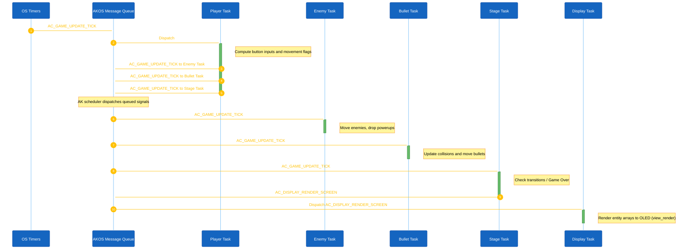

<h1 align="center">Runtime Signal Processing</h1>

This document details the signal routing, inter-task communication, timing execution, and rendering loops within the Space Shooter architecture. The application is built upon the AKOS event-driven operating system framework.

## 1. System Architecture Overview

In Space Shooter, the application logic is divided into 4 independent Game Tasks (`PLAYER`, `ENEMY`, `BULLET`, `STAGE`) and 1 Display Task (`AC_TASK_DISPLAY_ID`).
- **4 Game Tasks**: Manage separate logic (player movement, enemy AI, bullet physics, stage transitions) and are coordinated via a pipeline.
- **`AC_TASK_DISPLAY_ID`**: Exclusively manages screen rendering (`view_render()`) and passes asynchronous hardware interrupts to the Player Task.

Execution Pipeline:

1. **Game Initialization:** Player Task receives `AC_GAME_START_REQ`, initializing `game_logic_init()` and setting up global variables. The system activates a single periodic timer (50ms interval) that fires to the Player Task.
2. **Pipeline Logic Tick (50ms):** OS Timer sends the `AC_GAME_UPDATE_TICK` signal to the Player Task. After processing, the Player Task uses `task_post_pure_msg` to sequentially push the signal to the Enemy Task, Bullet Task, and Stage Task via the AKOS Message Queue.
3. **Physics & State:** Each task is successively awakened by the Scheduler to update positions, check collisions, and change game states.
4. **Render Trigger:** At the end of the cycle, the Stage Task sends the `AC_DISPLAY_RENDER_SCREEN` signal to `AC_TASK_DISPLAY_ID`.
5. **Rendering:** The Display task wakes up on `AC_DISPLAY_RENDER_SCREEN`, clears the buffer, reads the global entity arrays, and pushes pixels to OLED via `view_render()`.

### High-Level Component Diagram

#### 1. Screen Handlers

The overall state of the application is determined by AKOS's `view_render_list` screen scheduling mechanism:

- `scr_game_title`: Initialization screen. Awaits user input to transition to Menu.
- `scr_game_menu`: Main navigation providing access to Play, Setting, High score.
- `scr_game_play`: Active execution of physics and game logic. Receives render signals from the pipeline.
- `scr_game_setting`: Configuration of system parameters (e.g., Audio).
- `scr_game_highscore`: Data retrieval and display of the maximum recorded scores.
- `scr_game_gameover`: Termination screen displayed when `g_lives <= 0`.

#### 2. Periodic Execution Loop (Tick)

#### 3. Asynchronous Input Processing

All button inputs use AKOS asynchronous messaging. The Display task receives hardware interrupts and forwards signals to the Player Task as needed for character control.

| Hardware Input | Initial Target Task | Final Routing | Action Taken |
|---|---|---|---|
| `MODE` Button | `AC_TASK_DISPLAY_ID` | Posts `AC_GAME_BTN_MODE` to `AC_TASK_GAME_PLAYER_ID` | Triggers bullet spawn if playing, or `Select` in menus. |
| `UP` Button (Press) | `AC_TASK_DISPLAY_ID` | Posts `AC_GAME_BTN_UP` to Player Task | Sets `g_is_moving_left = true`. |
| `UP` Button (Release) | `AC_TASK_DISPLAY_ID` | Posts `AC_GAME_BTN_UP_RELEASED` to Player Task | Clears `g_is_moving_left = false`. |
| `DOWN` Button (Press) | `AC_TASK_DISPLAY_ID` | Posts `AC_GAME_BTN_DOWN` to Player Task | Sets `g_is_moving_right = true`. |
| `DOWN` Button (Release) | `AC_TASK_DISPLAY_ID` | Posts `AC_GAME_BTN_DOWN_RELEASED` to Player Task | Clears `g_is_moving_right = false`. |

## 2. Source Code Index

To review the implementation of the aforementioned systems, refer to the following split architecture files:

| Subsystem | File Path |
|---|---|
| Game Tasks (Independent Processing) | `application/sources/app/space_shooter/game_shooter_player_task.cpp`, `game_shooter_enemy_task.cpp`, `game_shooter_bullet_task.cpp`, `game_shooter_stage_task.cpp` |
| Parallax & Background Rendering | `application/sources/app/space_shooter/game_shooter_render.cpp` |
| UI State Management & Rendering | `application/sources/app/screens/scr_game_*.cpp` (e.g., `scr_game_play.cpp`) |
| AKOS Task Instantiation & Config | `application/sources/app/task_list.cpp` |
