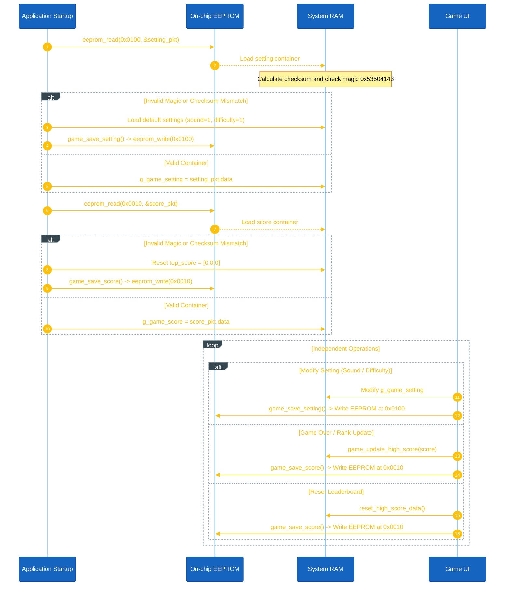

<h1 align="center">Persistent Data Storage Design</h1>

This document details the persistent storage mechanism for game settings and high score leaderboards in Space Shooter, implemented via internal EEPROM memory on the STM32L151.

---

## I. Data Structure & Memory Layout

The application separates non-volatile data into two independent structures in `game_save.h` to optimize write performance and memory lifespan:

```cpp
#define GAME_SAVE_MAGIC          ((uint32_t)0x53504143) // "SPAC" (SPACE)

#define APP_EEPROM_SCORE_ADDR    (0x0010)
#define APP_EEPROM_SETTING_ADDR  (0x0100)

/* Game Configuration Settings */
typedef struct {
	uint8_t sound_en;   // Audio state (0: OFF, 1: ON)
	uint8_t difficulty; // Game difficulty (0: EASY, 1: MED, 2: HARD)
} game_setting_t;

/* High Score Leaderboard */
typedef struct {
	uint32_t top_score[3]; // Top 1, Top 2, Top 3 scores
} game_score_t;

/* Container Structs with Magic Number & Checksum Protection */
typedef struct {
	uint32_t magic_number;
	game_setting_t data;
	uint8_t check_sum;
} game_setting_eeprom_t;

typedef struct {
	uint32_t magic_number;
	game_score_t data;
	uint8_t check_sum;
} game_score_eeprom_t;
```

### Memory Map:

| Block | EEPROM Address | Container Struct | Payload | Protection |
|---|---|---|---|---|
| Score Data | `0x0010` (`APP_EEPROM_SCORE_ADDR`) | `game_score_eeprom_t` | `game_score_t` (12 Bytes) | Magic Number + 8-bit Checksum |
| Setting Data | `0x0100` (`APP_EEPROM_SETTING_ADDR`) | `game_setting_eeprom_t` | `game_setting_t` (2 Bytes) | Magic Number + 8-bit Checksum |

---

## II. Lifecycle & Integrity Protection Workflow



---

## III. Operations & APIs

| Function | Module | Description |
|---|---|---|
| `game_load_data()` | `game_save.cpp` | Reads EEPROM blocks `0x0100` and `0x0010`. Validates magic key `0x53504143` and Checksum; restores defaults on corrupted block. |
| `game_save_setting()` | `game_save.cpp` | Computes Checksum for `g_game_setting` and writes `game_setting_eeprom_t` directly to EEPROM offset `0x0100`. |
| `game_save_score()` | `game_save.cpp` | Computes Checksum for `g_game_score` and writes `game_score_eeprom_t` directly to EEPROM offset `0x0010`. |
| `game_save_data()` | `game_save.cpp` | Helper function invoking both `game_save_setting()` and `game_save_score()`. |
| `reset_high_score_data()` | `game_save.cpp` | Resets `top_score[0..2]` to 0 and saves exclusively to EEPROM offset `0x0010`. |
| `game_update_high_score(score)` | `game_save.cpp` | Evaluates final score against the leaderboard, inserts at correct rank (1-3), and saves exclusively to EEPROM offset `0x0010`. |

---

## IV. Code References

- **Header Definitions:** `application/sources/app/space_shooter/game_save.h`
- **Implementation:** `application/sources/app/space_shooter/game_save.cpp`
- **Driver Header:** `application/sources/driver/eeprom/eeprom.h`
