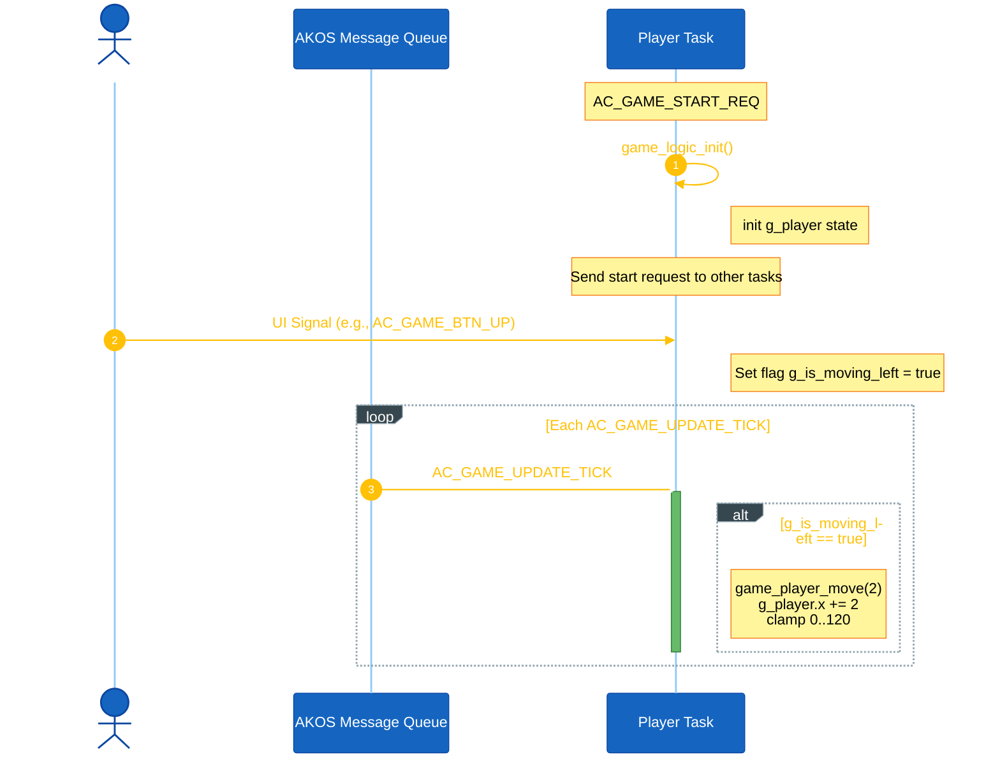
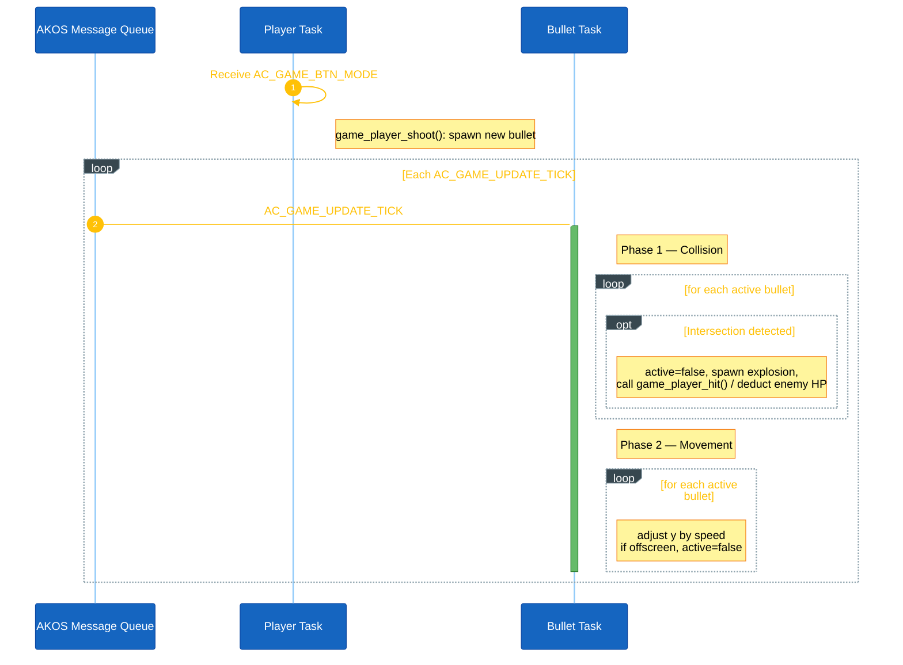
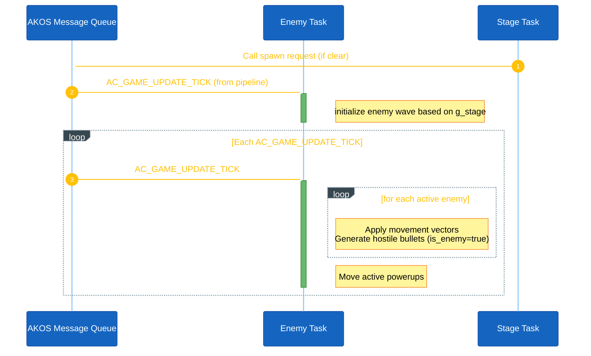

<h1 align="center">Game Object Sequences</h1>

This document describes the runtime sequence of each main object in Space Shooter. Space Shooter separates objects into independent tasks: Player, Enemy, Bullet, Stage, and a Render module. All objects are periodically evaluated via the `AC_GAME_UPDATE_TICK` signal routed through the task pipeline.

## I. Object Summary

| Task / Module | Main Data | Routine | Main responsibility |
|---|---|---|---|
| `PLAYER` | `g_player` | `update_player_sliding_and_timers()` | Controls the user-controlled unit, tracks volatile health parameters, and cooldowns. |
| `BULLET` | `g_bullets[]` | `game_physics_update()` | Handles translation of projectiles, checks collisions (AABB / pixel-perfect), and spawns explosions. |
| `ENEMY` | `g_enemies[]` | `game_enemy_update()` | Handles movement logic, enemy projectile generation, and boss spawning. Manages powerup drops. |
| `STAGE` | `g_stage` | `game_stage_update()` | Checks wave transitions (when enemies are cleared) and routes to Game Over when lives are exhausted. |
| Render Module | `g_stars[]` | `game_background_update()` | Moves background space effects (parallax) and coordinates screen rendering. (Not a separate task) |

The Stage task receives a 50ms periodic timer which dispatches `AC_GAME_UPDATE_TICK`. On each tick, it sequentially pushes the tick signal down the pipeline to the other tasks via the AKOS message queue.

## II. Player Object Sequence

The Player task owns the `g_player` struct (coordinate, lives, score, state).

**Setup.** `game_logic_init()` parks the player at `x = 60` and sets `lives = 3`.

**Input.** Hardware button interrupts route asynchronous signals directly from the Display Task to `AC_TASK_GAME_PLAYER_ID`.

**Per-tick.** Smooth sliding state is handled via `g_is_moving_left` and `g_is_moving_right` flags:
- If a flag is active (button held), continuously adjusts `g_player.x` and clamps to screen bounds.
- Blinking logic: `g_player.blink_timer` is decremented each tick if `> 0`.

<strong><em>Figure 1:</em></strong> Player sequence logic

## III. Bullet Object Sequence

Bullet task owns the `g_bullets[MAX_BULLETS]` array.

**Shooting.** On `AC_GAME_BTN_MODE`, the Player Task calls `game_player_shoot()` to spawn a new bullet. The Enemy Task can also spawn enemy bullets via `game_boss_shoot()`.

**Per-tick.** Upon receiving `AC_GAME_UPDATE_TICK` from the queue, it calls `game_physics_update()`:
- **Collision Check:** Player bullets are checked against active enemies. Enemy bullets are checked against the player (pixel-perfect). If hit, triggers an Explosion.
- **Movement:** Visible bullets translate (`y -= speed` or `y += speed`).

<strong><em>Figure 2:</em></strong> Bullet sequence logic

## IV. Enemy Object Sequence

The Enemy Task manages the `g_enemies[MAX_ENEMIES]` and `g_powerups[MAX_POWERUPS]` arrays.

**Setup & Spawn.** `game_enemy_spawn()` creates a wave or Boss based on `g_stage`. This is triggered at the start of the game or when the Stage Task detects the screen is clear.

**Per-tick.** Each `AC_GAME_UPDATE_TICK` calls `game_enemy_update()`:
- **Movement & Abilities:** Enemies move according to their internal states. The Boss executes dynamic phases. Carriers spawn minions.
- **Powerups:** Translates active powerups falling down the screen.

<strong><em>Figure 3:</em></strong> Enemy sequence logic

