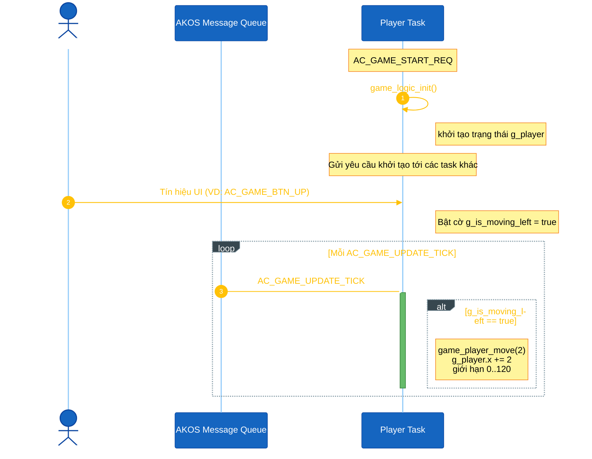
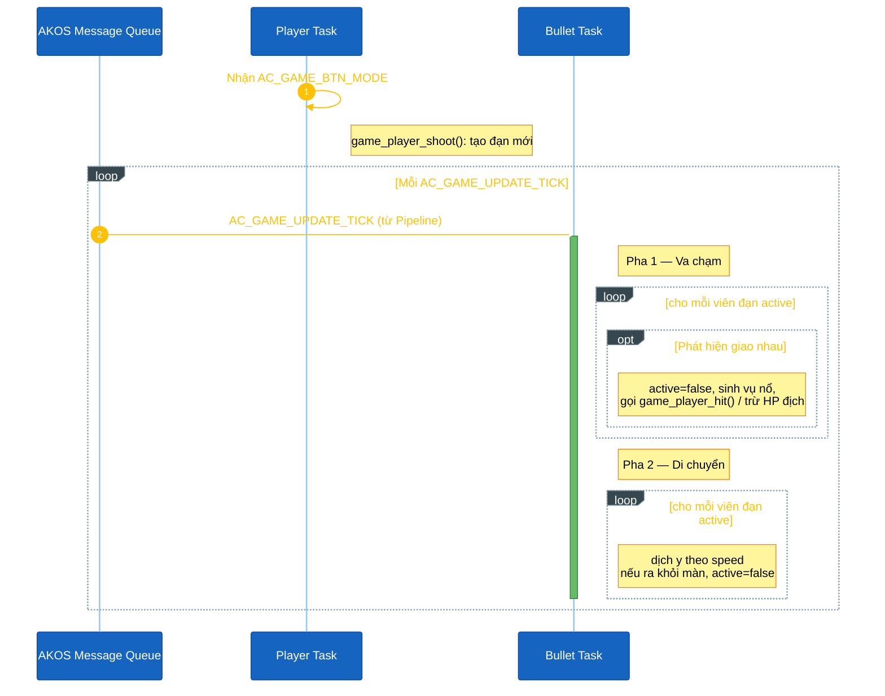
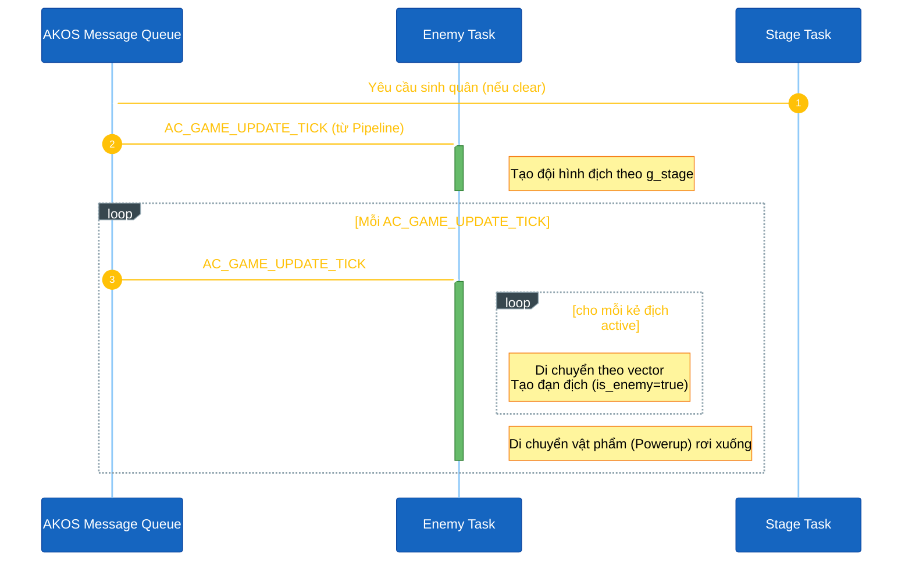

<h1 align="center">Trình tự Đối tượng Game</h1>

Tài liệu này mô tả trình tự chạy của từng đối tượng chính trong Space Shooter. Space Shooter phân tách các đối tượng thành các tác vụ (Task) độc lập gồm: Player, Enemy, Bullet, Stage và module Render. Toàn bộ các đối tượng được đánh giá định kỳ thông qua tín hiệu `AC_GAME_UPDATE_TICK` được Stage Task điều phối qua hàng đợi tin nhắn AKOS.

## I. Tóm tắt các Đối tượng (Tasks)

| Tác vụ (Task) | Dữ liệu chính | Hàm xử lý chính | Trách nhiệm chính |
|---|---|---|---|
| `PLAYER` | `g_player` | `update_player_sliding_and_timers()` | Điều khiển tàu của người chơi, trạng thái mạng sống và đếm ngược hồi chiêu. |
| `BULLET` | `g_bullets[]` | `game_physics_update()` | Quản lý di chuyển của đạn và kiểm tra va chạm (AABB / pixel-perfect), sinh vụ nổ. |
| `ENEMY` | `g_enemies[]` | `game_enemy_update()` | Xử lý logic di chuyển, sinh đạn của địch, và sinh boss. Quản lý rơi vật phẩm hỗ trợ. |
| `STAGE` | `g_stage` | `game_stage_update()` | Kiểm tra chuyển màn (khi hết địch) và điều hướng màn hình Game Over khi hết mạng. |
| Module Render | `g_stars[]` | `game_background_update()` | Di chuyển hiệu ứng nền vũ trụ (parallax) và điều phối vẽ màn hình. (Không phải 1 task riêng lẻ) |

Task Stage sẽ thiết lập một timer định kỳ 50ms khi nhận `AC_GAME_START_REQ`. Timer này sẽ gửi tín hiệu `AC_GAME_UPDATE_TICK` tới nó, sau đó Stage sẽ đẩy tín hiệu tiếp tới các task khác thông qua hàng đợi tin nhắn của AKOS.

## II. Trình tự Đối tượng Player

Player sở hữu cấu trúc `g_player` chứa tọa độ, mạng sống, điểm số và trạng thái.

**Khởi tạo.** `game_logic_init()` đặt người chơi tại `x = 60` và thiết lập `lives = 3`.

**Đầu vào.** Ngắt nút bấm phần cứng (hardware interrupts) gửi tín hiệu trực tiếp từ Display Task tới `AC_TASK_GAME_PLAYER_ID`.

**Mỗi chu kỳ (Per-tick).** Trạng thái mượt (smooth sliding) được xử lý thông qua cờ `g_is_moving_left` và `g_is_moving_right`:
- Nếu cờ đang bật (nút được giữ) — trừ hoặc cộng tọa độ `g_player.x` liên tục và giới hạn trong khoảng kích thước màn hình.
- Logic nhấp nháy: `g_player.blink_timer` giảm dần mỗi chu kỳ nếu đang `> 0`.

<strong><em>Hình 1:</em></strong> Trình tự logic của Player Task

## III. Trình tự Đối tượng Bullet

Bullet sở hữu mảng `g_bullets[MAX_BULLETS]`. 

**Sinh đạn.** Khi nhận nút MODE, Player Task gọi `game_player_shoot()` để tạo viên đạn mới. Enemy Task cũng có thể sinh đạn địch qua hàm `game_boss_shoot()`.

**Mỗi chu kỳ (Per-tick).** Khi nhận tín hiệu `AC_GAME_UPDATE_TICK` từ hàng đợi tin nhắn (do Stage Task đẩy vào), Bullet Task gọi `game_physics_update()`:
- **Kiểm tra va chạm:** Đạn của người chơi được so sánh với kẻ địch. Đạn của kẻ địch được so sánh với tàu người chơi (va chạm pixel-perfect). Nếu có va chạm, sinh ra Vụ nổ (Explosion).
- **Di chuyển:** Đạn hiển thị sẽ dịch chuyển (`y -= speed` hoặc `y += speed`).

<strong><em>Hình 2:</em></strong> Trình tự logic của Bullet Task

## IV. Trình tự Đối tượng Enemy

Enemy Task quản lý mảng `g_enemies[MAX_ENEMIES]` và `g_powerups[MAX_POWERUPS]`.

**Khởi tạo & Sinh quân.** `game_enemy_spawn()` tạo đợt quân hoặc Boss theo `g_stage`. Lệnh này được kích hoạt khi bắt đầu game hoặc khi Stage Task nhận thấy màn đã dọn sạch.

**Mỗi chu kỳ (Per-tick).** Enemy Task cập nhật thông qua `AC_GAME_UPDATE_TICK`:
- **Di chuyển:** Cập nhật vị trí kẻ địch theo vector `enemy_dir` và logic AI (Boss).
- **Rơi vật phẩm:** Cập nhật chiều dọc rơi tự do của `g_powerups`.

<strong><em>Hình 3:</em></strong> Trình tự logic của Enemy Task

## V. Thứ tự Thực thi Mỗi chu kỳ

Hệ thống sử dụng một Timer duy nhất định kỳ 50ms bắn tín hiệu cho Stage Task. Từ đây, Stage đóng vai trò Orchestrator, đẩy tin nhắn (enqueue) `AC_GAME_UPDATE_TICK` cho Player, Enemy và Bullet. Do dùng chung Priority, AKOS sẽ lập lịch theo thứ tự FIFO (First In, First Out). Trình tự thực thi như sau:

1. **Stage Task (Bộ điều phối):** 
    - Đẩy tin nhắn cho Player, Enemy, Bullet.
    - Kiểm tra chuyển màn (nếu hết địch) hoặc Game Over (nếu hết mạng).
    - Đẩy tín hiệu `AC_DISPLAY_RENDER_SCREEN` cho Display.
2. **Player Task:** Xử lý lướt di chuyển mượt và trừ lùi các bộ đếm.
3. **Enemy Task:** Kẻ địch di chuyển, tấn công. Vật phẩm rơi xuống.
4. **Bullet Task:** Đạn bay, xử lý vật lý va chạm.
5. **Display Task:** Gọi module Render vẽ mọi thứ ra màn hình.

## VI. Tài liệu Tham chiếu Mã Nguồn

Dưới đây là 10 file mã nguồn độc lập tạo thành logic hoàn chỉnh của Game:

| Tác vụ / Đối tượng | Tệp mã nguồn (Source) | Tệp tiêu đề (Header) |
|---|---|---|
| Player Task | `game_shooter_player_task.cpp` | `game_shooter_player_task.h` |
| Enemy Task | `game_shooter_enemy_task.cpp` | `game_shooter_enemy_task.h` |
| Bullet Task | `game_shooter_bullet_task.cpp` | `game_shooter_bullet_task.h` |
| Stage Task | `game_shooter_stage_task.cpp` | `game_shooter_stage_task.h` |
| Render Module | `game_shooter_render.cpp` | `game_shooter_render.h` |
| Lưu Game & Cấu hình | `game_save.cpp` | `game_save.h` |
| UI & Màn hình | `screens/scr_game_*.cpp` | `screens/screens.h` |

> **Lưu ý:** Tất cả tệp tác vụ nằm trong thư mục `application/sources/app/space_shooter/`. Các tệp màn hình nằm ở `application/sources/app/screens/`.
