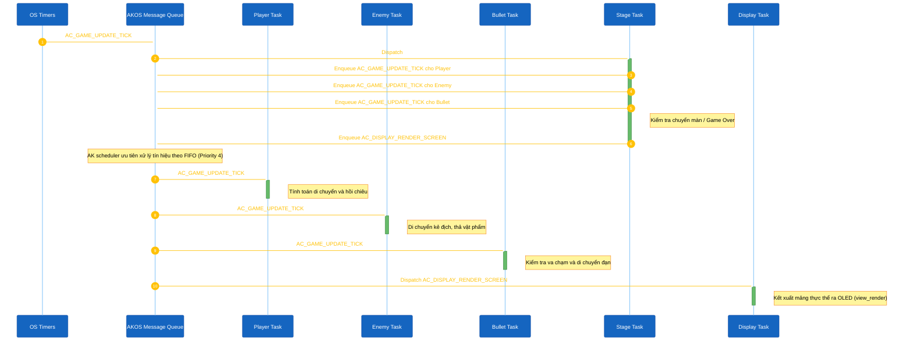

<h1 align="center">Xử lý Tín hiệu Thời gian thực</h1>

Tài liệu này trình bày chi tiết về định tuyến tín hiệu, giao tiếp giữa các tác vụ (inter-task communication), vòng lặp thời gian và vòng lặp kết xuất đồ họa trong kiến trúc của Space Shooter. Ứng dụng được xây dựng dựa trên hệ điều hành hướng sự kiện AKOS.

## 1. Tổng quan Kiến trúc Hệ thống

Trong Space Shooter, logic của ứng dụng được chia tách thành 4 Task Game độc lập (`PLAYER`, `ENEMY`, `BULLET`, `STAGE`) và 1 Task Display (`AC_TASK_DISPLAY_ID`).
- **4 Game Tasks**: Quản lý từng phần logic riêng biệt (di chuyển người chơi, AI kẻ địch, vật lý đạn, chuyển màn) và được điều phối bằng Timer.
- **`AC_TASK_DISPLAY_ID`**: Độc quyền quản lý kết xuất màn hình (`view_render()`) và chuyển tiếp các ngắt phần cứng tới Player Task.

Đường ống Thực thi (Execution Pipeline):

1. **Khởi tạo Game:** Player Task nhận tín hiệu `AC_GAME_START_REQ`, gọi `game_logic_init()` và gửi `AC_GAME_START_REQ` tới các task khác. Khi Stage Task nhận được yêu cầu này, hệ thống sẽ kích hoạt 1 timer định kỳ (chu kỳ 50ms) gửi về cho Stage Task.
2. **Nhịp Logic Pipeline (50ms):** OS Timer gửi tín hiệu `AC_GAME_UPDATE_TICK` tới Stage Task. Stage Task đóng vai trò như một Bộ điều phối (Orchestrator) và dùng `task_post_pure_msg` lần lượt đẩy tín hiệu tick tới Player Task, Enemy Task và Bullet Task thông qua hàng đợi tin nhắn của AKOS, trước khi tự xử lý logic chuyển màn và Game Over của riêng nó.
3. **Kích hoạt Render:** Ở cuối quá trình xử lý tick, Stage Task gửi tín hiệu `AC_DISPLAY_RENDER_SCREEN` tới `AC_TASK_DISPLAY_ID`.
4. **Vật lý & Trạng thái:** Do các task đều chia sẻ cùng mức ưu tiên (priority), AKOS lập lịch chúng theo thứ tự vào trước ra trước (FIFO). Mỗi Task (Player, Enemy, Bullet, Display) lần lượt được Scheduler gọi dậy để cập nhật vị trí, kiểm tra va chạm, và cuối cùng là kết xuất đồ họa.
5. **Kết xuất Đồ họa:** Display task thức dậy khi nhận `AC_DISPLAY_RENDER_SCREEN`, xóa bộ đệm (buffer), đọc các biến trạng thái từ 4 Task và gọi API kết xuất `view_render()`.

### Sơ đồ Thành phần Cấp cao

#### 1. Bộ chuyển hướng Màn hình (Screen Handlers)

Trạng thái tổng thể của ứng dụng được xác định bởi cơ chế điều phối màn hình `view_render_list` của AKOS:

- `scr_game_title`: Màn hình khởi tạo ban đầu. Chờ người dùng thao tác để chuyển sang Menu.
- `scr_game_menu`: Điều hướng chính gồm các lựa chọn Play, Setting, High score.
- `scr_game_play`: Đang thực thi tích cực vật lý và logic game. Nhận tín hiệu đồ họa từ tín hiệu Render độc lập.
- `scr_game_setting`: Cấu hình các thông số hệ thống (ví dụ: Âm thanh).
- `scr_game_highscore`: Lấy dữ liệu và hiển thị điểm số cao nhất.
- `scr_game_gameover`: Màn hình kết thúc hiển thị sau khi số mạng `game_get_lives() <= 0`.

#### 2. Vòng lặp Thực thi Định kỳ (Tick)

#### 3. Xử lý Đầu vào Bất đồng bộ

Toàn bộ đầu vào nút bấm đều sử dụng tin nhắn bất đồng bộ của AKOS. Display task nhận ngắt phần cứng và chuyển tiếp (forward) tín hiệu tới Player Task khi cần điều khiển nhân vật.

| Nút bấm Phần cứng | Tác vụ Đích Ban đầu | Định tuyến Cuối cùng | Hành động |
|---|---|---|---|
| `MODE` Button | `AC_TASK_DISPLAY_ID` | Gửi tín hiệu `AC_GAME_BTN_MODE` tới `AC_TASK_GAME_PLAYER_ID` | Kích hoạt tạo đạn nếu đang chơi, hoặc Chọn (Select) ở Menu. |
| `UP` Button (Nhấn) | `AC_TASK_DISPLAY_ID` | Gửi `AC_GAME_BTN_UP` tới `AC_TASK_GAME_PLAYER_ID` | Bật cờ `g_is_moving_left = true`. |
| `UP` Button (Thả) | `AC_TASK_DISPLAY_ID` | Gửi `AC_GAME_BTN_UP_RELEASED` tới `AC_TASK_GAME_PLAYER_ID` | Tắt cờ `g_is_moving_left = false`. |
| `DOWN` Button (Nhấn) | `AC_TASK_DISPLAY_ID` | Gửi `AC_GAME_BTN_DOWN` tới `AC_TASK_GAME_PLAYER_ID` | Bật cờ `g_is_moving_right = true`. |
| `DOWN` Button (Thả) | `AC_TASK_DISPLAY_ID` | Gửi `AC_GAME_BTN_DOWN_RELEASED` tới `AC_TASK_GAME_PLAYER_ID` | Tắt cờ `g_is_moving_right = false`. |

## 2. Chỉ mục Mã Nguồn

Để xem chi tiết cách triển khai hệ thống, tham khảo các tệp kiến trúc chia nhỏ sau:

| Hệ thống con | Đường dẫn Tệp |
|---|---|
| Game Tasks (Xử lý Độc lập) | `application/sources/app/space_shooter/game_shooter_player_task.cpp`, `game_shooter_enemy_task.cpp`, `game_shooter_bullet_task.cpp`, `game_shooter_stage_task.cpp` |
| Kết xuất Parallax & Background | `application/sources/app/space_shooter/game_shooter_render.cpp` |
| Quản lý Trạng thái UI & Kết xuất | `application/sources/app/screens/scr_game_*.cpp` (ví dụ: `scr_game_play.cpp`) |
| Khởi tạo Tác vụ AKOS & Cấu hình | `application/sources/app/task_list.cpp` |
