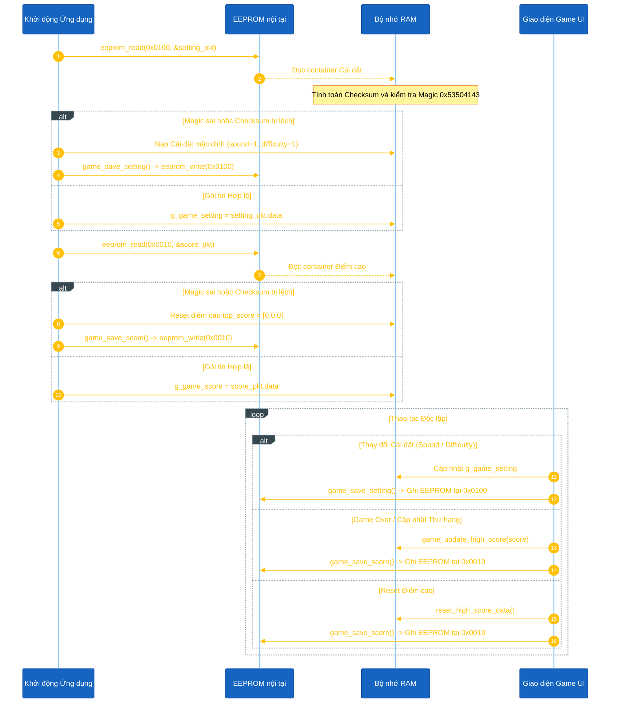

<h1 align="center">Thiết kế Lưu trữ Dữ liệu Không mất mát</h1>

Tài liệu này mô tả chi tiết cơ chế lưu trữ bền vững (persistent storage) các cài đặt game và bảng xếp hạng điểm cao trong Space Shooter thông qua bộ nhớ EEPROM nội tại của STM32L151.

---

## I. Cấu trúc Dữ liệu & Bố trí Bộ nhớ

Ứng dụng phân chia dữ liệu lưu trữ thành hai cấu trúc độc lập trong `game_save.h` để tối ưu hóa hiệu năng ghi và nâng cao tuổi thọ chip:

```cpp
#define GAME_SAVE_MAGIC          ((uint32_t)0x53504143) // "SPAC" (SPACE)

#define APP_EEPROM_SCORE_ADDR    (0x0010)
#define APP_EEPROM_SETTING_ADDR  (0x0100)

/* Cài đặt cấu hình Game */
typedef struct {
	uint8_t sound_en;   // Trạng thái âm thanh (0: Tắt, 1: Bật)
	uint8_t difficulty; // Độ khó của game (0: DỄ, 1: VỪA, 2: KHÓ)
} game_setting_t;

/* Bảng xếp hạng Điểm cao */
typedef struct {
	uint32_t top_score[3]; // Điểm Top 1, Top 2, Top 3
} game_score_t;

/* Struct Container bảo vệ bằng Magic Number & Checksum */
typedef struct {
	uint32_t magic_number;
	game_setting_t data;
	uint8_t check_sum;
} game_setting_eeprom_t;

typedef struct {
	uint32_t magic_number;
	game_score_t data;
	uint8_t check_sum;
} game_score_eeprom_t;
```

### Bản đồ Bộ nhớ:

| Khối Dữ liệu | Địa chỉ EEPROM | Container Struct | Dữ liệu Payload | Cơ chế Bảo vệ |
|---|---|---|---|---|
| Bảng điểm cao | `0x0010` (`APP_EEPROM_SCORE_ADDR`) | `game_score_eeprom_t` | `game_score_t` (12 Bytes) | Magic Number + Checksum 8-bit |
| Cài đặt Game | `0x0100` (`APP_EEPROM_SETTING_ADDR`) | `game_setting_eeprom_t` | `game_setting_t` (2 Bytes) | Magic Number + Checksum 8-bit |

---

## II. Vòng đời & Quy trình Bảo vệ Toàn vẹn Dữ liệu



---

## III. Các Hàm API chính

| Hàm | Module | Mô tả |
|---|---|---|
| `game_load_data()` | `game_save.cpp` | Đọc 2 khối EEPROM tại `0x0100` và `0x0010`. Kiểm tra Magic Key `0x53504143` và Checksum; tự động tạo lại mặc định nếu phát hiện khối bị lỗi. |
| `game_save_setting()` | `game_save.cpp` | Tính Checksum cho `g_game_setting` và ghi gói `game_setting_eeprom_t` trực tiếp vào địa chỉ EEPROM `0x0100`. |
| `game_save_score()` | `game_save.cpp` | Tính Checksum cho `g_game_score` và ghi gói `game_score_eeprom_t` trực tiếp vào địa chỉ EEPROM `0x0010`. |
| `game_save_data()` | `game_save.cpp` | Hàm tiện ích gọi cả `game_save_setting()` và `game_save_score()`. |
| `reset_high_score_data()` | `game_save.cpp` | Reset `top_score[0..2]` về 0 và ghi duy nhất vào địa chỉ EEPROM `0x0010`. |
| `game_update_high_score(score)` | `game_save.cpp` | So sánh điểm với Top 3, chèn thứ hạng (1-3) và ghi duy nhất vào địa chỉ EEPROM `0x0010`. |

---

## IV. Tham chiếu Mã nguồn

- **File Header:** `application/sources/app/space_shooter/game_save.h`
- **File Implementation:** `application/sources/app/space_shooter/game_save.cpp`
- **Driver Header:** `application/sources/driver/eeprom/eeprom.h`
